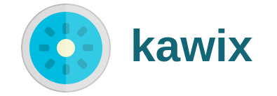

The next generation Javascript runtime written in and for nodejs. 
This purpose is give the benefits of an advanced loader, will al the features of current node.js + npm

* [@kawix/core](./core) The main module. Runtime with latest Javascript features, TypeScript and more
* [@kawix/dhs](./dhs) A HTTP/S server with dynamic code execution, hot reloading and much more features
* [@kawix/sites/x](./sites/x) Webserver based on dhs for the https://kwx.kodhe.com/x/ service
* [@kawix/gix](./gix) A standard library for interact with an electron instance for GUI
* [@kawix/std](./std) A standard library with some basic utilities and sublibraries

## Install runtime 

@kawix/core is available for Windows,Mac,GNU/Linux. Go to [INSTALL.md](./core/INSTALL.md) for instructions
